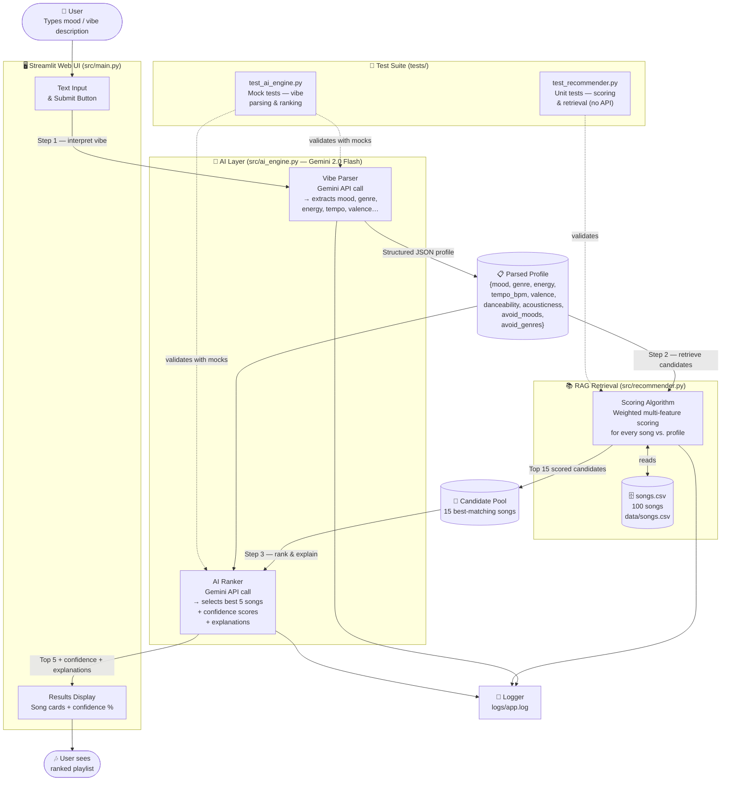

# AI Music Recommender — System Diagram

## Mermaid.js Diagram



## Component Descriptions

| Component | File | Responsibility |
|-----------|------|----------------|
| Streamlit Web UI | `src/main.py` | User input, step-by-step status, song card display |
| Vibe Parser | `src/ai_engine.py` | Gemini converts free-text vibe → structured JSON profile |
| RAG Retriever | `src/recommender.py` | Scores all 100 songs against the profile; returns top 15 |
| AI Ranker | `src/ai_engine.py` | Gemini re-ranks candidates, adds confidence scores & explanations |
| Logger | `logs/app.log` | Records every step, query text, errors, and result counts |
| Test Suite | `tests/` | Unit tests (no API) + mock-based AI function tests |

## Data Flow Summary

```
User free-text vibe
  → Gemini extracts structured profile (mood, genre, energy, …)
  → Scoring algorithm retrieves top 15 candidates from songs.csv
  → Gemini re-ranks candidates, assigns confidence %, writes explanations
  → Streamlit displays ranked songs with confidence badges
```

## Human Checkpoints

- **User review**: The user reads each explanation and confidence score, and can re-run with a different vibe description if results feel off.
- **Logged audit trail**: Every query and result is written to `logs/app.log` for inspection.
- **AI Interpretation details**: An expandable section in the UI shows the raw parsed JSON so users can see exactly how their vibe was interpreted.
